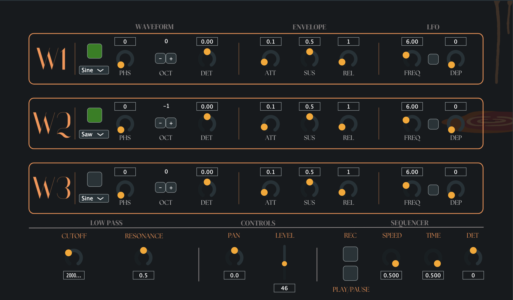
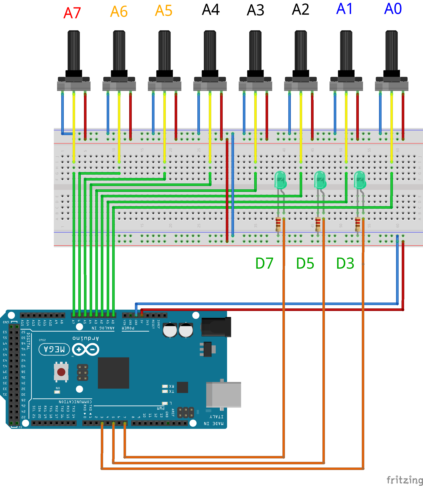
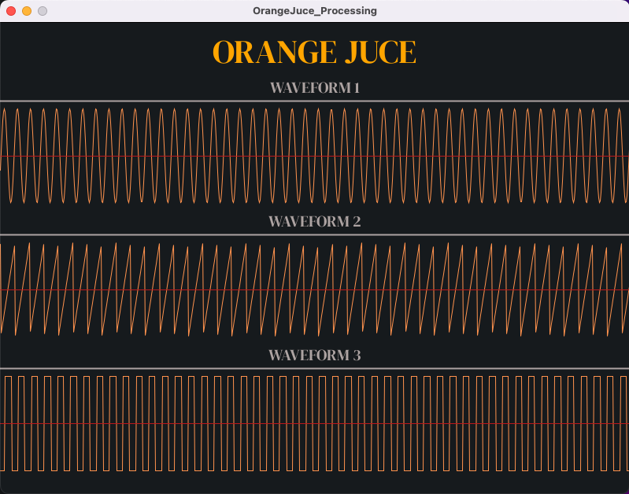

# OrangeJuce VST

### [Demonstration Video](https://polimi365-my.sharepoint.com/:v:/g/personal/10741332_polimi_it/Ea6OqXedb5VCjI7y6zLIKDsBJ6YVxNzBJ8rgeg05oeG2zw?nav=eyJyZWZlcnJhbEluZm8iOnsicmVmZXJyYWxBcHAiOiJPbmVEcml2ZUZvckJ1c2luZXNzIiwicmVmZXJyYWxBcHBQbGF0Zm9ybSI6IldlYiIsInJlZmVycmFsTW9kZSI6InZpZXciLCJyZWZlcnJhbFZpZXciOiJNeUZpbGVzTGlua0NvcHkifX0&e=6NH66C)

VST made by students of the course of Computer Music Language and Systems at Politecnico di Milano. The project, named OrangeJuce, is divided into four sections, each utilizing different programming languages. Each section controls a distinct portion of the main project, contributing to the overall functionality of the VST.

### SuperCollider
SuperCollider acts as the main core of the VST, responsible for sound generation. It uses a SynthDef to modulate waveforms based on external parameters. These parameters are controlled by OSC (Open Sound Control) messages sent by JUCE or serial strings sent by Arduino. Our SuperCollider implementation supports the generation of sound with up to three different waveforms, which can be played in a modulated sequencer. This flexibility allows for a wide range of sound design possibilities, making it a powerful tool for audio synthesis.

### JUCE
JUCE is responsible for the graphical user interface (GUI) of the VST. We have implemented various knobs and sliders within the VST, along with their respective listeners that respond to value changes. When a value is changed, JUCE sends an OSC message to SuperCollider with the updated parameters. This interaction ensures real-time control over the sound synthesis process, providing an intuitive and responsive user experience.

### ARDUINO
Arduino implements the hardware aspect of the VST, bringing virtual controls into the physical realm. It features seven knobs: two for waveform control, two for LFO (Low-Frequency Oscillator) adjustments, and three for the sequencer. An additional knob allows users to select which waveform they want to modify. Three LED indicators help users identify which waveform is currently being controlled. This hardware integration enhances the tactile feedback and hands-on manipulation of sound parameters.

### PROCESSING
Processing is used to visualize the three modified waveforms. The waveforms are animated according to the frequency of the note being played and dynamically change based on the parameters being modified. This visual representation aids in understanding the impact of parameter adjustments on the sound, providing an engaging and informative visual feedback loop.

## Instruction

Open the SuperCollider code and press Ctrl+Enter (Windows) or Cmd + Enter (MacOS) in the line of s.boot and in the bracket above "main code" label. Make sure you have the right serial port in "~port" before running the second parts of the code to activate arduino. You can verify it by running "Serial.devices;" at the end of the code and writing the relative port associated to Arduino.

Once the SuperCollider code is running, open your VST to start interacting with the interface and control the sound synthesis and launch the processig app to visualize the waveforms.

### Waveforms
At the top of the interface, you will find the waveform parameters section:

Waveform Selection: Choose the shape of your waveform using the selection box on the left and activate it by pressing the square button.

Phase and Detune: Adjust the phase and detune using the corresponding knobs.

Octave Changer: Use the button to change the octave.

Envelope Zone: Set the typical envelope parameters such as Attack, Release, and Value.

LFO Section: Activate the LFO with the square button and adjust the LFO frequency and depth using the respective knobs.

You will notice three waveforms with similar parameters that can be combined by activating or deactivating each waveform.

### Low Filter
In the lower section, you will find the cutoff filter:

Cutoff Parameter: Adjust the cutoff frequency to shape the sound.

Resonance: Modify the resonance to emphasize certain frequencies.

### General parameters
At the center of the interface, you will find general control sliders:

Pan Slider: Adjust the stereo panning of the sound.

Level Slider: Control the overall output level.

### Sequencer
At the end we have the sequencer. We can record our set of notes by pressing the red button and then playing notes. Then we can pause and stop the sequencer with the relative button. We can change the time between one set and the next one, the speed between notes and the detuning of the semitones.
